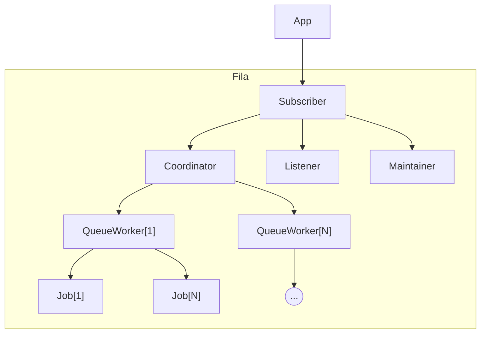
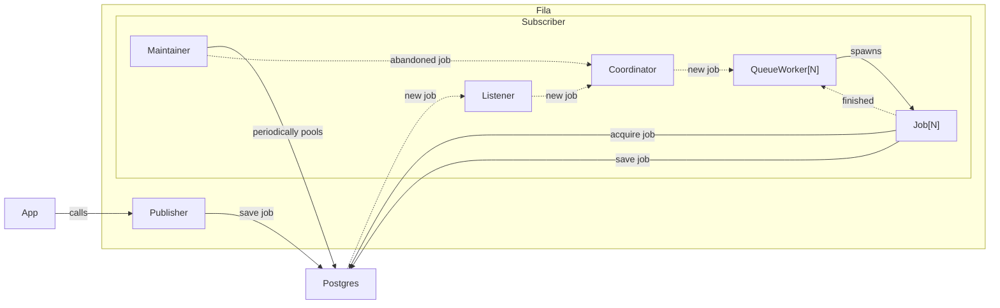

# Task hierarchy diagram

```mermaid
graph TB
    App
    App --> Subscriber

    subgraph Fila
        Subscriber
        Subscriber --> Coordinator
        Subscriber --> Listener
        Subscriber --> Maintainer

            Coordinator
            Coordinator --> QueueWorker1
            Coordinator --> QueueWorker2

                QueueWorker1["QueueWorker[1]"]
                QueueWorker1 --> Job1
                QueueWorker1 --> Job2

                    Job1["Job[1]"]
                    Job2["Job[N]"]

                QueueWorker2["QueueWorker[N]"]
                QueueWorker2 --> Job3

                    Job3((...))

            Listener

            Maintainer
    end
```

# Communication diagram

```mermaid
graph LR
    App
    App -- "calls" --> Publisher

    Postgres
    Postgres -. "new job" .-> Listener
    Publisher -- "save job" --> Postgres
    Maintainer -- "periodically pools" --> Postgres
    Job -- "acquire job" --> Postgres
    Job -- "save job" --> Postgres

    subgraph Fila
        Publisher

        subgraph Subscriber
            Coordinator
            Coordinator -. "new job" .-> QueueWorker

                QueueWorker["QueueWorker[N]"]
                QueueWorker -- "spawns" --> Job

                    Job["Job[N]"]
                    Job -. "finished" .-> QueueWorker


            Listener
            Listener -. "new job" .-> Coordinator

            Maintainer
            Maintainer -. "abandoned job" .-> Coordinator
        end
    end
```
